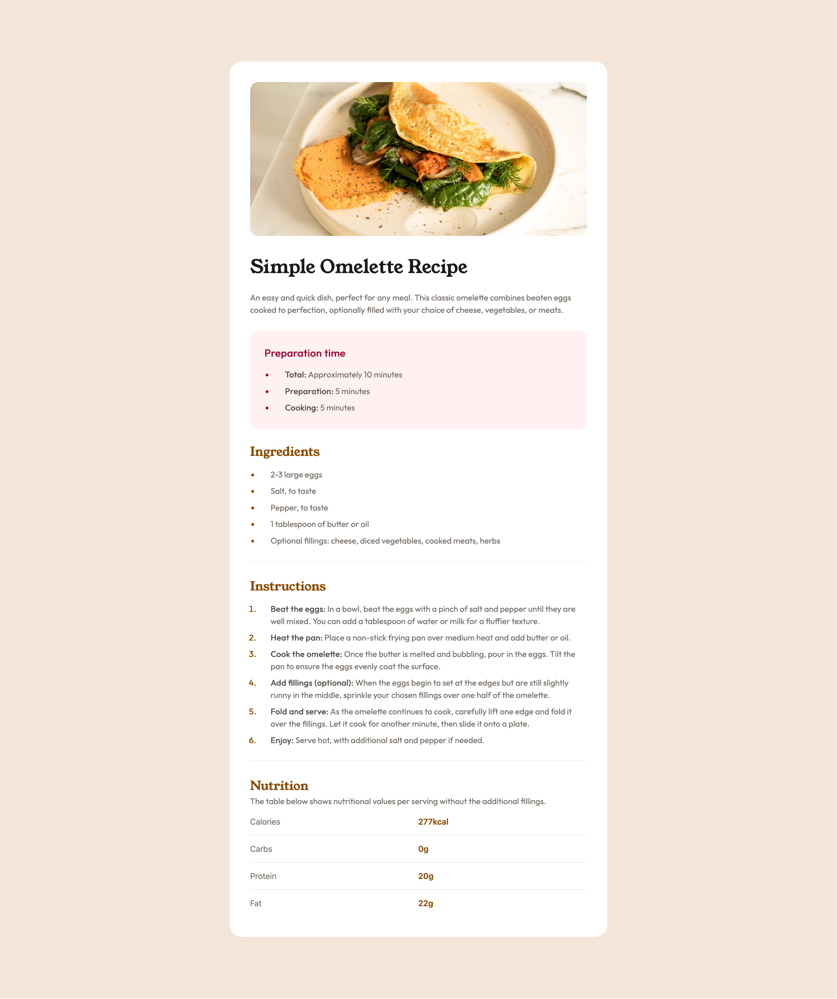

# Frontend Mentor - Recipe page solution

This is a solution to the [Recipe page challenge on Frontend Mentor](https://www.frontendmentor.io/challenges/recipe-page-KiTsR8QQKm). Frontend Mentor challenges help you improve your coding skills by building realistic projects.

## Table of contents

- [Frontend Mentor - Recipe page solution](#frontend-mentor---recipe-page-solution)
  - [Table of contents](#table-of-contents)
  - [Overview](#overview)
    - [Screenshot](#screenshot)
    - [Links](#links)
  - [My process](#my-process)
    - [Built with](#built-with)
    - [What I learned](#what-i-learned)
    - [Continued development](#continued-development)
    - [Useful resources](#useful-resources)
  - [Author](#author)

**Note: Delete this note and update the table of contents based on what sections you keep.**

## Overview

### Screenshot

### Links

- Solution URL: [Add solution URL here](https://your-solution-url.com)
- Live Site URL: [Recipe page](https://cedric-91.github.io/recipe-page-main/)

## My process

### Built with

- Semantic HTML5 markup
- Tailwindcss
- Flexbox
- CSS Grid
- Mobile-first workflow

### What I learned

Using the utilities classes such as (Tailwindcss) definetley speeds up your development, and not having to come up
with class names is it breath of fresh air. There's definetley a slight learning curve, but got used to it
after some time (trail/error).

The downside is, I found myrself writing the same classes each time on a number of sections on this page. Maybe, because
I'm not using frameworks and just pure HTML.

### Continued development

Will for sure continue adopting Tailwindcss, into my future projects. I see the benefits of using it and it's definetley a learning shift
of not writing your custom css.

**Note: Delete this note and the content within this section and replace with your own plans for continued development.**

### Useful resources

- [Tailwindcss](https://tailwindcss.com/) - Was definetley going back and forward on this website, mainly for colours and fonts and utitilies classes

## Author

- Website - [Add your name here](https://www.your-site.com)
- Frontend Mentor - [@cedric-91](https://www.frontendmentor.io/profile/cedric-91)
